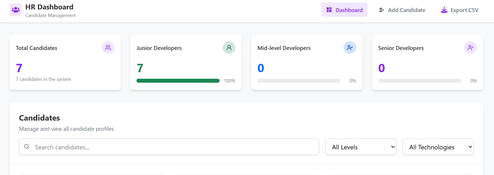

# HR Candidate Management Dashboard

A modern, responsive dashboard for HR professionals to manage job candidates efficiently.

## Features

- **Candidate Management**: Add, edit, view, and delete candidate profiles
- **Dashboard View**: Visual statistics showing candidate distribution by experience level
- **Filtering & Search**: Filter candidates by experience level, technology, or search by name/role
- **Pagination**: Navigate through large sets of candidate data with ease
- **CSV Export**: Export all candidate data to CSV format
- **Tech Stack Tagging**: Tag candidates with their technical skills
- **Responsive Design**: Works on desktop, tablet, and mobile devices
- **Toast Notifications**: User-friendly notifications using react-toastify

